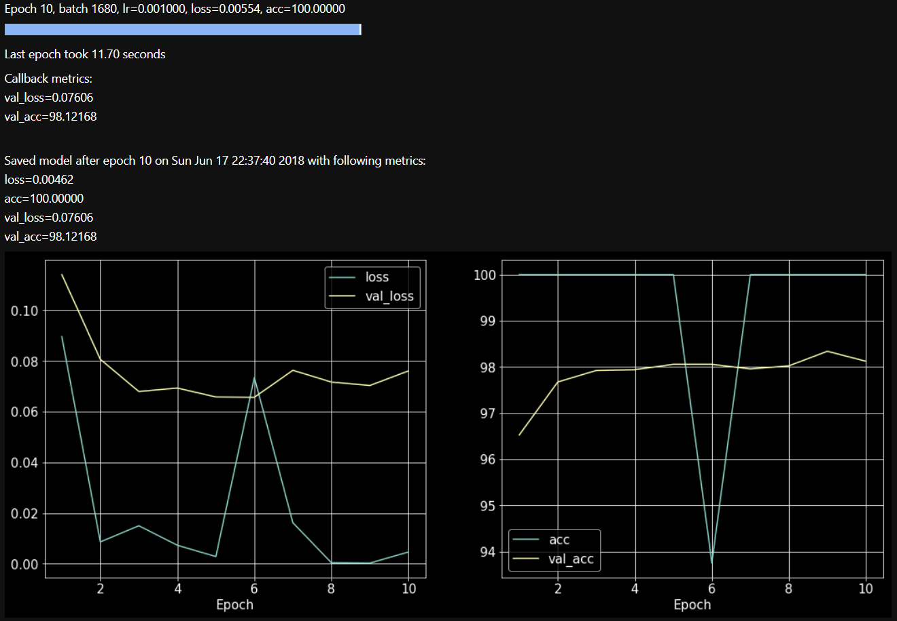

# PytorchUtils
Some utilities for building models in pytorch.

## Installation
First, clone this repository using   
`git clone https://github.com/rajatvd/PytorchUtils/`  

Then, `cd` into the directory named `package` and run the following command:  
`pip install .`  

## NBFigure
An extension of matplotlib figures to jupyter notebooks which are rendered using IPython Image displays. The plots are saved on disk and reloaded as images, allowing them to be easily updated dynamically. Useful for live loss plots.

## RNN modules
Currently contains:

* __WrappedLSTM__ :  a pytorch nn Module which wraps an input and output module around an lstm. The whole module now works solely with packed sequences, and padding is not required.

## Train utils
Contains a Trainer class. It can be used to call a train loop with a model, DataLoader, optimizer, atrainOnBatch function and an epoch callback function to train a model for a given number of epochs. Automatically saves the model, displays a live animated metric plot, and a progress bar for each epoch.

